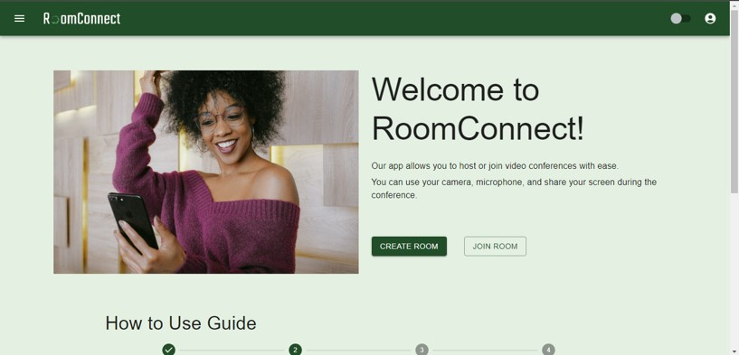
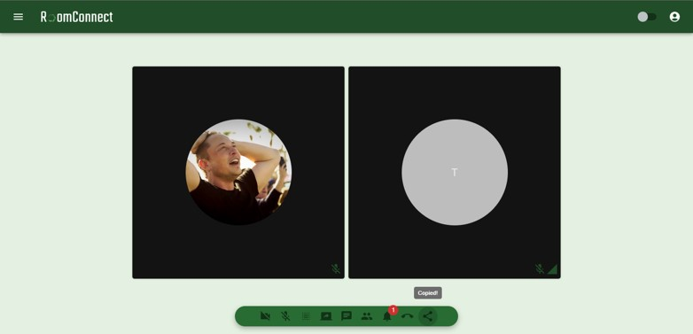
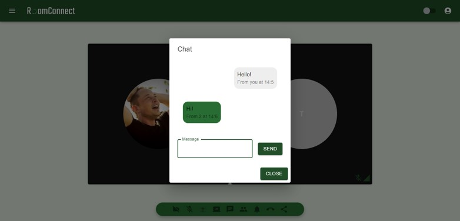
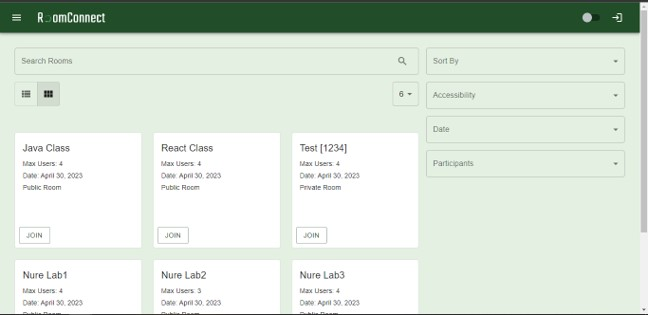
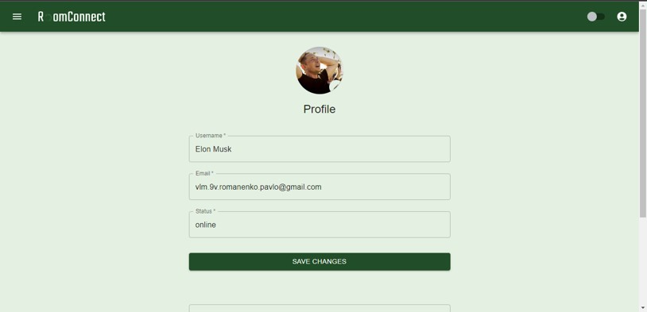

# React Video Conferencing Client App

This is a client-side web application for video conferencing built with React.

## Features
- Join or start a new video conference
- Invite other participants by sharing a conference link
- Enable/disable media
- Share screen
- Chat with other participants
- Change background with Mediapipe

## Installation
1. Clone the repository
2. Install the dependencies using `npm install`
3. Start the development server using `npm start`
4. Navigate to `http://localhost:3000` to view the app in your browser

## Usage
1. To start a new conference, click on the "Create room" button on the home screen. 
2. To join an existing conference, enter the room ID in the "Join room" input field and click the "Join" button.
3. Once you have joined a conference, you can toggle your audio and video on/off, share your screen, and use the chat feature to communicate with other participants.
4. You can also blur your background and share your conference.

## Demo Pictures

## Technologies Used
- React.js
- Redux
- Material-UI
- React Router
- Socket.IO
- WebRTC
- Mediapipe
- React Spring
